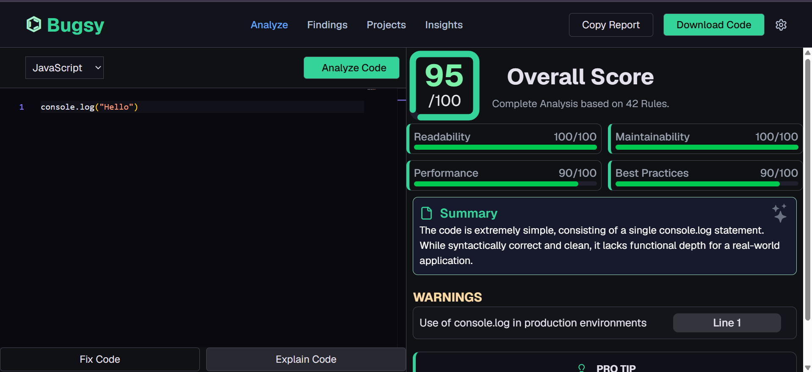
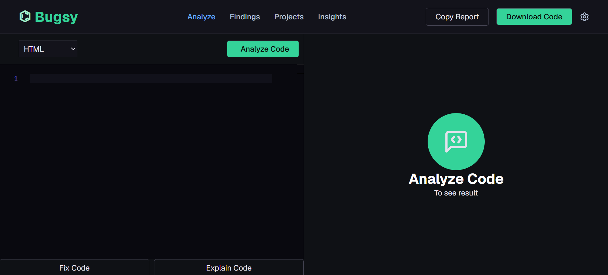
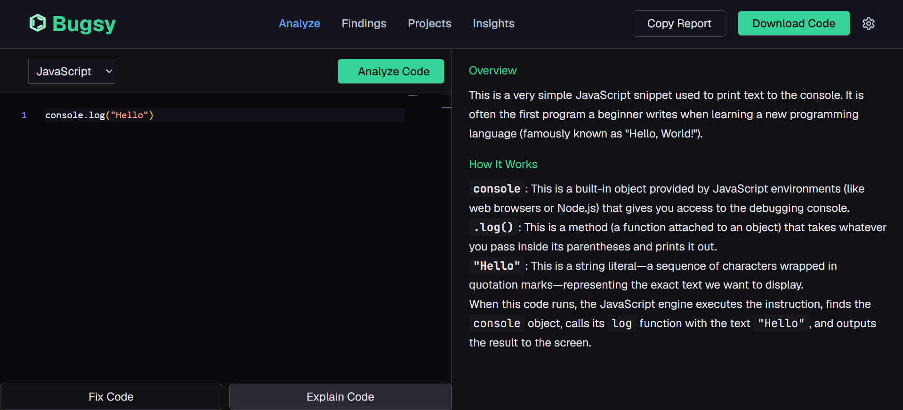

🐞 Bugsie — AI-Powered Code Review Assistant

Write code. Bugsie finds what went wrong.

## 📸 Preview







Bugsie is an AI-powered code review tool built with React and Google Gemini. It analyzes source code and provides actionable feedback on bugs, security issues, code quality, and best practices through a clean, developer-focused interface.

✨ Features
🤖 AI Code Analysis — Get automated code reviews powered by Google Gemini.
📊 Code Quality Score — Overall score with a relevant category-wise breakdown.
🚨 Critical Issues — Highlights serious bugs and security vulnerabilities.
⚠️ Warnings — Detects potential problems and questionable practices.
🔐 Security Audit — Identifies security-related risks in your code.
✅ Compliance Standards — Displays relevant coding and security checks.
💡 AI Pro Tips — Get practical engineering recommendations.
📖 Explain Code — Understand your code through clear, structured explanations.
🔧 Fix Code — Generate an improved version of problematic code.
📝 Markdown Support — Cleanly renders AI-generated explanations.
💻 Monaco Editor — VS Code-style coding experience.
🌐 Multi-Language Support — Supports JavaScript, TypeScript, Python, Java, C++, C, C#, Go, Rust, PHP, Ruby, Kotlin, Swift, Dart, HTML, CSS, SQL, and Shell.
🛠️ Tech Stack
Frontend: React.js
Build Tool: Vite
AI: Google Gemini API
Code Editor: Monaco Editor
Markdown: React Markdown
Styling: Tailwind CSS + CSS
Icons: React Icons
Loading UI: React Spinners
```
🧠 How Bugsie Works
Write / Paste Code
        ↓
   Select Language
        ↓
    Bugsie AI
        ↓
   Google Gemini
        ↓
 ┌───────────────────┐
 │ Overall Score     │
 │ Critical Issues   │
 │ Warnings          │
 │ Security Audit    │
 │ Compliance        │
 │ Pro Tip           │
 └───────────────────┘
        ↓
 Explain / Fix Code
🔍 Core Capabilities
Analyze
```
Bugsie reviews your code and dynamically generates:

Overall code quality score
Relevant quality categories
Critical issues
Warnings
Security metrics
Compliance checks
Engineering recommendations
📖 Explain

Get a structured Markdown explanation of your code, including relevant concepts, logic, and execution flow.

🔧 Fix

Bugsie can identify and improve:

Syntax errors
Runtime issues
Security vulnerabilities
Logic problems
Performance issues
Code quality and readability
🎯 Why Bugsie?

Writing code is only part of software development.

Understanding, reviewing, and improving that code is what makes it better.

Bugsie brings AI-powered code analysis, explanation, and fixing into one developer-focused workspace.

🔮 Future Improvements
User authentication
Project-based code management
Code review history
GitHub repository integration
Advanced AI refactoring
Backend API architecture
Advanced security analysis
Team collaboration
📄 License

This project is currently available for educational and portfolio purposes.

⭐ If you find Bugsie useful, consider giving the repository a star!

Built with React + Gemini AI. 🐞
